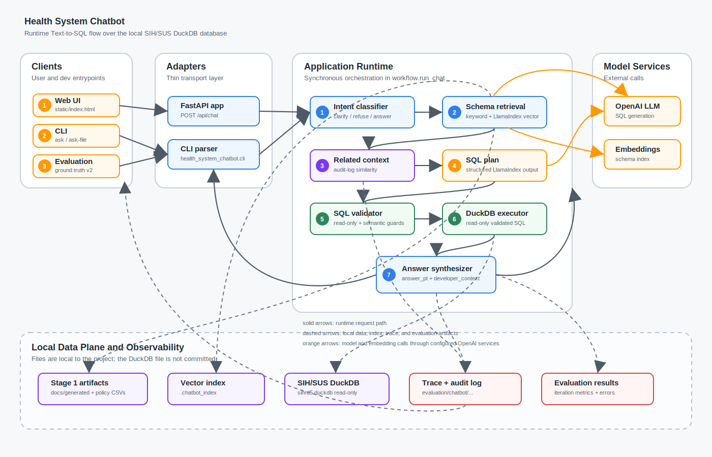

# Health System Chatbot

Projeto para preparar um chatbot Text-to-SQL sobre dados hospitalares do
SIH/SUS a partir do banco local `sihrd5.duckdb`.

## Status Atual

Stage 1 esta concluida como fase de entendimento de dados e preparacao de
avaliacao. A Stage 2 ja possui um corte vertical funcional do chatbot
Text-to-SQL com LlamaIndex, validacao deterministica de SQL, execucao read-only
em DuckDB, CLI e avaliacao automatizada contra o ground truth v2.

Artefatos gerados:

- catalogo tecnico do banco, tabelas, colunas e perfis;
- dicionario de negocio para usuarios de saude no Brasil;
- mapa de relacionamentos e chaves candidatas;
- relatorio de qualidade de dados;
- metodologia de desenho das consultas;
- ground truth Text-to-SQL validado com 100 perguntas;
- evidencias de resultado para todas as queries aceitas;
- notas de prontidao para Stage 2.

## Banco de Dados

O banco principal e `sihrd5.duckdb`, com cerca de 25 GiB no ambiente local. Ele
nao deve ser versionado no Git.

O `.gitignore` bloqueia:

- `*.duckdb`
- `*.duckdb.wal`
- `*.duckdb.tmp`

## Estrutura

```text
.
|-- GOAL.md
|-- docs/
|   |-- database_overview.md
|   |-- schema_catalog.md
|   |-- business_dictionary.md
|   |-- relationship_map.md
|   |-- data_quality_report.md
|   |-- query_design_methodology.md
|   |-- stage2_readiness.md
|   |-- assets/
|   `-- generated/
|-- evaluation/
|   |-- chatbot/
|   `-- ground_truth/
|-- src/
|   `-- health_system_chatbot/
|-- scripts/
|   |-- sihrd5_stage1.py
|   |-- chat_smoke.py
|   |-- evaluate_chatbot.py
|   `-- verify_stage1.py
```

## Arquitetura Atual



O projeto esta organizado como um chatbot Text-to-SQL local, com adaptadores
finos para CLI e HTTP e um pipeline central em `workflow.run_chat`. A API
FastAPI e a CLI chamam o mesmo fluxo, o que mantem a semantica de resposta,
validacao e auditoria alinhada entre interface web e terminal. A avaliacao
automatizada (`evaluation.evaluate_dataset`) e uma trilha de desenvolvimento
separada: ela reutiliza os componentes centrais de classificacao, contexto,
geracao SQL, validacao e execucao para medir qualidade, mas nao sintetiza
`ChatbotAnswer` nem registra conversa como usuario.

Fluxo principal:

1. O usuario envia uma pergunta pela interface web ou CLI (`ask`/`ask-file`).
2. `intent.classify_question` decide se a pergunta pode ser respondida,
   precisa de esclarecimento ou deve ser recusada.
3. `schema_context.retrieve_context` recupera tabelas, colunas, politicas de
   join e caveats a partir dos artefatos da Stage 1. Quando disponivel, usa o
   indice LlamaIndex em `.chatbot_index`; caso contrario, usa recuperacao por
   palavras-chave.
4. `audit.find_related_audit_context` busca perguntas anteriores relacionadas
   no audit log para dar continuidade ao contexto da conversa.
5. `sql_generator.generate_sql_plan` chama o modelo configurado via LlamaIndex
   e OpenAI para gerar um `SqlPlan` estruturado.
6. `sql_validator.validate_sql` aplica guardrails deterministas: somente
   `SELECT`/`WITH`, bloqueio de comandos mutantes, validacao de tabelas,
   politicas de relacionamento, joins territoriais e comparacoes incompativeis
   como codigo numerico de municipio contra literal textual.
7. `duckdb_executor.execute_validated_sql` executa apenas SQL validada em
   `sihrd5.duckdb` em modo read-only.
8. `answer_synthesizer.synthesize_answer` gera a resposta final em linguagem
   natural para o usuario e preserva os detalhes de desenvolvimento em
   `result_summary`, `sql`, `caveats`, `evidence` e `developer_context`.
9. `workflow.run_chat` grava traces e audit log em `evaluation/chatbot/` para
   depuracao, auditoria e avaliacao posterior.

Trilha de avaliacao:

- `evaluation.evaluate_dataset` le o ground truth v2, executa os componentes
  centrais ate `duckdb_executor.execute_validated_sql` e grava metricas em
  `evaluation/chatbot/results/`.
- Essa trilha nao substitui `workflow.run_chat`: ela existe para regressao e
  analise de erros durante o desenvolvimento.

Decisoes arquiteturais importantes:

- O banco `sihrd5.duckdb` e a fonte operacional local; ele nao e versionado.
- O ground truth v2 nao e usado como atalho de resposta. Ele e usado para
  avaliacao automatizada.
- O LLM gera o plano SQL, mas a execucao depende de validacao deterministica
  antes de consultar o DuckDB.
- A resposta final para o usuario fica separada dos artefatos tecnicos, para
  manter boa experiencia de uso sem perder rastreabilidade durante o
  desenvolvimento.
- O audit log funciona como memoria leve de perguntas relacionadas; ele nao
  substitui os artefatos de schema nem o banco.

## Stage 1

O plano executado esta em `GOAL.md`.

Resultados principais:

- 234 tabelas inventariadas.
- 23 tabelas no schema analitico `main`.
- 211 tabelas de auditoria dbt em `main_dbt_test__audit`.
- 2.415 colunas catalogadas.
- 166 colunas do schema `main` perfiladas.
- 23 estimativas de armazenamento de tabelas.
- 23 chaves candidatas confirmadas.
- 20 relacionamentos avaliados.
- 15 checagens de qualidade de dados.
- 100 perguntas Text-to-SQL validadas.

Distribuicao do ground truth:

| Dificuldade | Quantidade |
| --- | ---: |
| L1 | 15 |
| L2 | 25 |
| L3 | 25 |
| L4 | 20 |
| L5 | 15 |

## Gerar Artefatos

Requer um ambiente Python com `duckdb` instalado e o arquivo `sihrd5.duckdb` na
raiz do projeto.

```bash
.venv/bin/python scripts/sihrd5_stage1.py
```

O script abre o banco em modo read-only, executa consultas de inventario,
perfilamento, qualidade e validacao, e escreve os artefatos em `docs/` e
`evaluation/ground_truth/`.

## Verificar

```bash
.venv/bin/python scripts/verify_stage1.py
```

Ultima verificacao executada:

```text
PASS: Stage 1 artifacts verified
questions=100 distribution={'L1': 15, 'L2': 25, 'L3': 25, 'L4': 20, 'L5': 15}
evidence_files=100
```

Tambem foi feita uma reexecucao independente das 100 queries salvas contra
`sihrd5.duckdb`, comparando row counts e hashes dos resultados com as evidencias
armazenadas:

```text
reexecuted=100 seconds=92.039 failures=0
```

## Stage 2

A implementacao do chatbot consome os achados da Stage 1, especialmente:

- diferenciar municipio de residencia (`MUNIC_RES`) de municipio do hospital
  (`hospital.MUNIC_MOV`);
- evitar multiplicacao acidental de internacoes ao juntar procedimentos;
- declarar se metricas financeiras usam `VAL_TOT` ou componentes;
- usar dimensoes de CID, procedimento, hospital e municipio para respostas
  legiveis;
- pedir esclarecimento ou recusar perguntas ambiguas sobre custo, producao,
  mortalidade ou local sem denominador e recorte definidos.
- gerar uma resposta final amigavel em `answer_pt`, mantendo SQL, caveats,
  evidencias e contexto de desenvolvimento disponiveis no payload.

Arquivos principais:

- `chat_goal.md`: plano de implementacao e criterios de aceite.
- `src/health_system_chatbot/`: pacote do chatbot.
- `src/health_system_chatbot/workflow.py`: orquestracao principal do runtime.
- `src/health_system_chatbot/answer_synthesizer.py`: resposta final e contexto
  de desenvolvimento.
- `scripts/chat_smoke.py`: smoke test conversacional.
- `scripts/evaluate_chatbot.py`: avaliacao contra ground truth.
- `evaluation/chatbot/results/`: resultados de avaliacao.
- `evaluation/chatbot/error_analysis/`: analise de erros por iteracao.
- `evaluation/chatbot/traces/`: traces JSON por pergunta executada.
- `evaluation/chatbot/audit/chat_audit.jsonl`: log append-only de auditoria.

Comandos:

```bash
.venv/bin/python -m health_system_chatbot.cli ask "Quantas internacoes existem na tabela principal?" --show-sql
.venv/bin/python scripts/chat_smoke.py
.venv/bin/python scripts/evaluate_chatbot.py --dataset evaluation/ground_truth/stage1_questions_v2.jsonl --output evaluation/chatbot/results/iteration_002.json
```

Auditoria e perguntas em lote:

```bash
.venv/bin/python -m health_system_chatbot.cli ask-file perguntas.txt --show-sql
.venv/bin/python -m health_system_chatbot.cli audit-log --limit 20
```

Cada pergunta enviada por `ask` ou `ask-file` e registrada em
`evaluation/chatbot/audit/chat_audit.jsonl` com pergunta, status, resposta,
passos executados, SQL gerado/validado, resultado, erros quando existirem e
status de corretude. Para perguntas ad hoc, a corretude fica como
`not_evaluated`; no benchmark, a corretude fica registrada nos arquivos de
avaliacao em `evaluation/chatbot/results/`.

O ground truth v2 nao e usado como rota de resposta do chatbot. Ele serve para
avaliacao: o runtime recupera contexto de schema/regras via LlamaIndex e gera
SQL com o modelo configurado. A flag `--no-llm` e apenas para debug e tende a
falhar em perguntas novas, porque desliga a geracao do modelo.

### Interface Web

Antes da interface web, o projeto expunha o chatbot pela CLI. A camada HTTP
agora usa FastAPI como adaptador fino sobre o mesmo `run_chat` usado pelo
comando `ask`.

Executar localmente:

```bash
.venv/bin/health-system-chatbot-api --reload
```

Alternativa equivalente:

```bash
.venv/bin/uvicorn health_system_chatbot.api:app --reload
```

Depois, abra `http://127.0.0.1:8000`.

Endpoints principais:

- `GET /`: frontend HTML simples para enviar perguntas.
- `GET /health`: status da API.
- `POST /api/chat`: envia `{ "question": "...", "show_sql": false, "allow_llm": true }` e retorna o `ChatbotAnswer`.

Ultima avaliacao Stage 2:

```text
total=100
intent_accuracy=1.0
sql_valid_rate=1.0
sql_execution_rate=1.0
result_match_rate=1.0
failures=0
```
